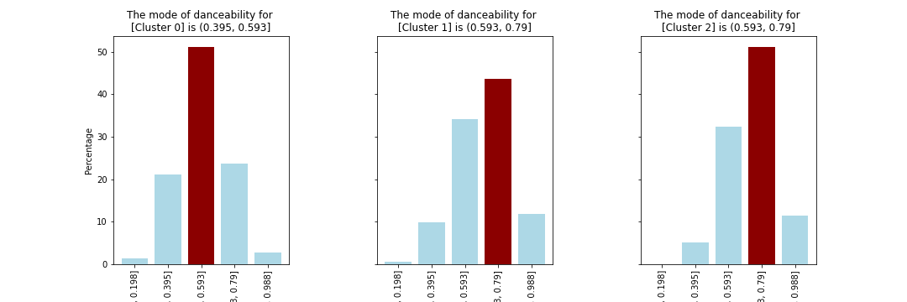
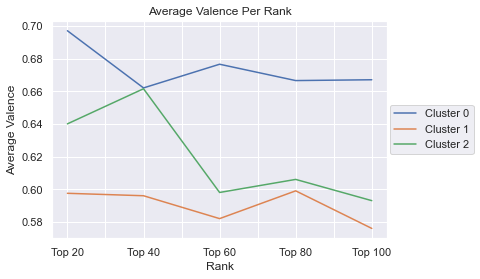
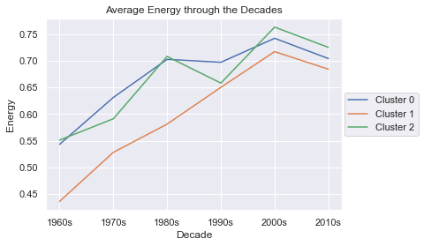

# UMN-Data_Analytics-Project_03
This repository contains Project #3 for the University of Minnesota's Data Analytics Bootcamp.

# Billboard's Top 100 Songs Machine Learning Model
Aaron Wollman, Kelsey Richardson Blackwell, Will Huang

# Project Proposal
[Project Proposal](https://docs.google.com/document/d/18lH5qNpat62voNdJxxNazMAmrfGYoD7WSlTHtPxM6YI/edit)

# Project Summary
We created a k-means model on billboard's top 100 songs from the 1960s to 2019, looks at attributes from Spotify. We ended up using non-scaled data to categorize the thousands of songs into 3 clusters. After creating and running the algorithm, we explored how the clusters related to the songs' attributes. This website will take you from modeling to what we found while graphing the clusters.

## K-Means Model
We had a clean dataset from [Project 1](https://github.com/12wollmana/UMN-Data_Analytics-Project_01), so we did not have to spend a lot of time on cleaning it. We first looked for the ideal value of k by creating an elbow graph. 

We created a model with scaled and non-scaled data. We looked at the Silouetter Score for each model and decided to use the non-scaled. The Silouetter Score is between -1 ot 1. If the value is closer to 1, the clusters are more dense and separated from the other clusters. 

In library.py we created a number of functions. The import_music_df_with_model function was important as it allowed us to remove dublicates and import the data into our jupyter notebooks.

## Graphing Clusters & Attributes
Next we created a number of graphs to see how the clusters were influenced by the attributes, decades, and placement. 

 \
   

## Website
We used [heroku](https://umn-data-analytics-p03-t01.herokuapp.com/) to host our report and vizualizations.

### Sources
[Dataset](https://github.com/fortyTwo102/hitpredictor-decade-util/tree/master/Database)\
[Silouetter Score](https://dzone.com/articles/kmeans-silhouette-score-explained-with-python-exam)\
[Elbow Graph](https://predictivehacks.com/k-means-elbow-method-code-for-python/)
